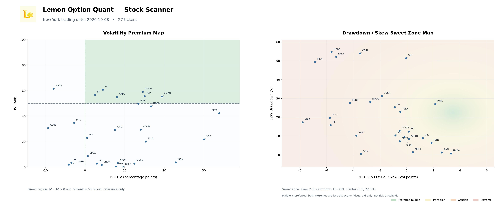

Copyright © 2026 Bo Hu. All rights reserved.

Created: September 13, 2026

Updated: October 8, 2026

# Lemon Option Quant

A local research tool for collecting U.S. option snapshots, evaluating cash-secured short puts, and monitoring daily stock metrics with a two-panel dashboard. Market-data collection uses Futu OpenAPI; the desktop GUI analyzes a user-entered Put against the existing SQLite history without connecting to OpenD or placing orders.

## Current Features

- Historical options data collection for OTM PUT and CALL contracts, with validation, duplicate protection, UTC timestamps, New York trading-date handling, and storage in `data/options.db`.
- Historical comparable selection by moneyness and days to expiration (DTE).
- Normalized premium statistics and percentile; historical IV percentile and descriptive statistics.
- Initial and remaining-holding-period annualized-return calculations with estimated Futu HK fixed-plan fees.
- Lemon Option Quant GUI with **New Position** and **Existing Position** tabs, English/Chinese switching, and a packaged Windows EXE. New Position analyzes one standard Put; Existing Position supports multiple standard contracts.
- Daily Stock Metrics Scanner for the current **27-ticker** watchlist: **IV Rank**, **IV-HV**, **52W Drawdown**, and **30D 25Δ Put-Call Skew**, stored separately in `data/stock_metrics.db`.
- A single daily command collects and saves metrics, generates the Stock Scanner Dashboard, closes connections, and exits automatically.
- Strict latest-trading-date dashboard slices and automatic date-based JPEG archiving under `outputs/stock_scanner/`.

## Quick Start

Use Python 3.11 or later in your project environment. Install the project from its root:

```powershell
python -m pip install -e .
```

The project declares `futu-api==10.10.7008` and `pandas`. The desktop window also requires Tkinter, normally included with the standard Windows Python distribution. No additional third-party GUI package is required.

### Open the Put GUI

```powershell
python scripts/launch_put_gui.py
```

The launcher resolves this checkout's source and `data/options.db` relative to its own location. It can also be launched from another working directory using the script's full path.

1. Enter an underlying, such as `IREN` or `US.NVDA`.
2. Click **Load Historical Price and Expirations** to load a timestamped historical stock price and known future expiration dates, or enter the values manually.
3. Select an expiration from the historical dropdown, use the adjacent **Calendar** button, or type `YYYY-MM-DD`.
4. Enter the option premium **per share**, strike, and underlying price. Prefer stock and option quotes from the same valuation time.
5. Click **Calculate Percentile and Initial Annualized Return**.

Numeric fields allow normal Backspace/Delete, Ctrl+A selection and copy/paste,
including empty or partial values while editing. Final numeric validation runs
when calculating. The calendar preserves ISO dates and existing expiration rules;
it introduces no dependency or calculation change.

The window shows:

| Output | Meaning |
|---|---|
| Historical premium percentile | Relative position of current premium / stock price among comparable historical Put snapshots |
| Initial annualized return | Simple ACT/365 return after estimated opening fees, using full strike collateral |
| Historical IV percentile | Latest stored IV for the exact Put versus valid prior premium-comparable observations; reference only, not a trading signal |
| Sample coverage | Valid snapshot count, distinct New York dates, and historical date range |
| Supporting values | DTE, moneyness, collateral, gross/net premium, fees, and historical premium-ratio median/range |

**Historical reference prices are not live quotes.** The expiration list comes from the database and may not include every currently listed contract. The database is opened read-only. Missing history or missing stock price does not prevent annualized-return calculation; unavailable percentiles are not displayed as zero.

IV is matched by underlying, Put type, expiration, and exact strike, with its source
contract and timestamp shown in the details. It is not inferred from the entered
premium. IV peers reuse the premium peer set but must precede the stored IV
timestamp, so IV and premium sample counts can differ. The existing IV analyzer
uses a strict-below percentile and accepts any nonempty valid set; zero valid
prior observations show **Insufficient historical IV data**, while fewer than
20 snapshots or 5 trading dates show a limited-coverage warning. No IV score,
entry threshold, or buy/sell recommendation is introduced.

The same window has **New Position** and **Existing Position** tabs. Changing the underlying clears that page's contract inputs and results while keeping the selected underlying. Switching tabs starts a fresh analysis on the destination page (contracts default to 1); returning to a page does not restore its previous analysis. Language and database settings are preserved. Existing Position accepts underlying, expiration, strike per share, current executable buyback premium per share (normally Ask), positive integer contracts (default 1), and current underlying price per share. Its three cards show remaining annualized return, remaining potential profit, and gross collateral. Details include buyback cost, avoided buy-to-close fee and source, period return, and OTM/ATM/ITM with strike/spot moneyness. Spot is context only and never enters the remaining-return calculation. Existing Position does not load historical percentiles or ask for opening cash flows. Both pages share immediate English/Chinese switching, numeric editing, and the date picker. Same-day expiration, adjusted contracts, and live quotes are not supported; New Position still uses one contract.

Both tabs share a light workbench layout, with inputs beside results on wide windows and stacked on smaller windows. The header contains the language selector; calculation details group capital, fees, returns, and reference information. Styling does not encode trade recommendations.

See [GUI usage and limitations](docs/put_gui.md).

English is the default GUI language. The **Language** selector switches immediately
between **English** and **简体中文**, including existing result details and warnings,
without changing inputs, recalculating, or writing to the historical database.
The launcher remembers the choice in the ignored `data/gui_preferences.json` file.
English remains the canonical language of the code and analysis messages.

### Collect Historical Data

Start and log in to Futu OpenD with the appropriate market-data access, then run from the project root:

```powershell
python scripts/collect_options.py
```

Connection settings and the collection universe are in [config.py](src/option_quant/config.py):

```python
FUTU_HOST = "127.0.0.1"
FUTU_PORT = 11111
UNDERLYINGS = ["US.NVDA", "US.GOOG", "US.SPCX", "US.IREN", "US.NBIS"]
```

Collection is manual; approximately 10:30 AM New York time once per U.S. trading day is the intended schedule, not an installed scheduler. Unlike the GUI, this command writes validated snapshots to the database.

### Run the Daily Stock Metrics Scanner

With Futu OpenD running and the project dependencies plus Matplotlib installed, run:

```powershell
python scripts/run_stock_metrics.py
```

The single-command workflow is:

```text
Connect to Futu → collect 27 configured tickers → save stock_metrics.db
→ close connections → generate and save Dashboard JPEG → exit
```

The watchlist and connection settings come from [scanner config](live_short_put_scanner/config.py), independently of the historical collector's universe. Valid rows are saved to `data/stock_metrics.db`, with first-write-wins duplicate protection by ticker + New York trading date. Tickers with missing or invalid data are skipped with a reason; other tickers continue. The command exports without opening a chart window and returns a nonzero exit status for skipped tickers, resource errors, or export failure. It is a manually invoked daily workflow, not an installed scheduler.

| Metric | Source / meaning |
|---|---|
| IV Rank | Futu's current underlying overview IV Rank, on a 0–100 scale |
| IV-HV | Latest scanner historical IV minus HV, in percentage points |
| 52W Drawdown | Live spot relative to the highest historical underlying price in the scanner's one-year window, expressed as a percentage |
| 30D 25Δ Put-Call Skew | Put IV minus Call IV using contracts nearest Delta −0.25 / +0.25; an exact 30D expiry or interpolation between valid expiries bracketing 30D, with no extrapolation |

Spot and option quotes are live, while IV/HV use the latest scanner historical observation. Retrieval is sequential, not an atomic market snapshot. Temporary option rows stay in memory; this workflow does not read or write `options.db`.

### Read the Stock Scanner Dashboard



Representative snapshot: **October 8, 2026**, with **27 tickers**. This README asset is a copy of the latest local export at the time of this update, stored in `docs/assets/` so it can be committed with the documentation. Daily runs do not replace this representative image.

| Panel | Axes and visual reference |
|---|---|
| Left: **Volatility Premium Map** | X = IV-HV (percentage points); Y = IV Rank. The upper-right light-green region marks IV-HV > 0 and IV Rank > 50. |
| Right: **Drawdown / Skew Sweet Zone Map** | X = 30D 25Δ Put-Call Skew (vol points); Y = 52W Drawdown (%). The visual sweet zone is skew 2–5 and drawdown 15–30%, centered on (3.5, 22.5%). |

The right panel's background moves from green through yellow and orange to red away from the middle in either direction: higher values are not always better. Background colors are visual references, not scores, risk thresholds, or trading recommendations.

**Strict daily slicing:** both panels use only `MAX(trading_date)` from `stock_metrics.db`, on the New York date convention. Earlier dates are never mixed in, and tickers missing on that latest date are not backfilled from history. The daily runner additionally requires the latest stored date to match the current run's New York date; otherwise it refuses to export a stale dashboard. The title, ticker count, and filename all describe the same stored daily slice, which may contain fewer than 27 tickers.

JPEGs are automatically archived as:

```text
outputs/stock_scanner/YYYYMMDD_stock_scanner_dashboard.jpg
```

The date in the filename comes from the stored trading-date slice. Repeating an export for the same date refreshes that date's JPEG; other dates remain separate. `outputs/` is ignored by Git, so the README uses the stable relative image path above instead.

To view or re-export the latest stored slice without connecting to Futu:

```powershell
python scripts/show_stock_metrics_charts.py
python scripts/show_stock_metrics_charts.py --no-show
```

The first command also opens the interactive chart with hover details; the second only saves the JPEG. Hover details are not available in the static README image. See [chart usage and export options](docs/stock_metrics_charts.md).

## Analysis Conventions

### Historical Premium Percentile

```text
moneyness = strike / underlying_price
premium_ratio = option_premium / underlying_price
percentile = 100 × count(historical premium_ratio < current premium_ratio) / sample_count
```

The GUI uses the same underlying, moneyness within ±0.02 (two percentage points), and DTE within ±5 days. Only snapshots strictly earlier than the current valuation timestamp are eligible. Calls, invalid prices, invalid DTEs, and invalid timestamps are excluded before comparison.

Historical premium uses `last / underlying_price`. Equal values do not contribute to the strict-less-than percentile. Each snapshot row has equal weight; repeated observations across contracts and dates are not independent trades. The window flags fewer than 20 samples or fewer than 5 distinct trading dates as limited coverage. These are informational thresholds, not a statistical confidence guarantee.

The collector stores OTM Puts and Calls, while the GUI uses Put comparables only and does not report percentiles for ITM Puts. A high percentile is not a win probability or a standalone trading recommendation.

### Cash-Secured Put Returns

For `N` standard contracts, `M = 100 × N`, strike `K`, initial per-share premium `P0`, current buyback premium `Pt`, and actual remaining days `D`:

```text
Gross collateral = K × M
Initial annualized return = (P0 × M − opening_fee) / collateral × 365 / initial_D
Remaining annualized return = (Pt × M + closing_fee) / collateral × 365 / remaining_D
```

Remaining return compares holding to worthless expiry with closing now. The original premium and opening fee cancel from this comparison. The closing fee is added because holding avoids that immediate expense. Worthless expiration requires no transaction and incurs no transaction fee.

Fees default to a **Futu HK fixed-plan US equity-option estimate**, using the rate snapshot checked on September 28, 2026. Minimum commissions and sell-only charges are handled separately. Actual statement fees may override the estimate; broker rounding, execution splits, discounts, and future rate changes may differ.

New Position uses one contract; Existing Position accepts a positive integer contract count. Both use full strike collateral and calendar days from today's New York date. The independent module also supports multiple contracts and timezone-aware timestamps with fractional days. It rejects nonpositive time to expiration. Returns are simple annualizations, not compounded or guaranteed returns, and assume worthless expiry without assignment.

The analytics layer returns objective values only and makes no open, hold, or close recommendations.

See [formulas, collateral, fees, and examples](docs/put_annualized_return.md). For an offline example:

```powershell
python scripts/analyze_put_return.py
```

## Historical Data

Collection currently keeps OTM PUT and CALL contracts satisfying:

```text
PUT:  0.70 × underlying_price <= strike < underlying_price
CALL: underlying_price < strike <= 1.30 × underlying_price
```

The collector retrieves option chains across available expirations from today to approximately one year ahead. `CollectionService` validates snapshots before storage and reports collected, rejected, saved, and duplicate row counts.

In `data/options.db`, SQLite table `option_snapshots` stores snapshot time, underlying, underlying price, option code, expiry, strike, DTE, last, bid, ask, volume, open interest, IV, delta, gamma, vega, theta, and `option_type` (PUT/CALL). Premium ratios, percentiles, fees, annualized returns, and GUI inputs are calculated in memory rather than added to the historical table.

Timestamps are stored in UTC. Duplicate protection uses underlying + option code + New York trading date. `data/` contains private market data and is excluded from Git. See the [data schema](docs/data_schema.md).

## Project Structure

```text
src/option_quant/
├── analytics/
│   ├── comparable_options.py
│   ├── futu_option_fees.py
│   ├── iv_analysis.py
│   ├── moneyness.py
│   ├── premium_analysis.py
│   ├── put_annualized_return.py
│   ├── put_preview.py
│   ├── daily_stock_metrics.py
│   ├── daily_stock_metrics_market_data.py
│   ├── skew.py
│   ├── stock_metrics.py
│   ├── stock_metrics_database.py
│   └── stock_metrics_charts.py
├── collection_result.py
├── collection_service.py
├── collector.py
├── config.py
├── database.py
├── date_picker.py
├── filters.py
├── futu_client.py
├── gui_i18n.py
├── gui_strings.py
├── put_gui.py
├── rate_limiter.py
├── retry.py
├── time_utils.py
└── validator.py
scripts/
├── collect_options.py
├── analyze_put_return.py
├── launch_put_gui.py
├── run_stock_metrics.py
└── show_stock_metrics_charts.py
live_short_put_scanner/
docs/
├── architecture.md
├── data_schema.md
├── put_annualized_return.md
├── put_gui.md
├── daily_stock_metrics.md
├── stock_metrics_charts.md
└── assets/
    └── stock-scanner-dashboard.jpg
outputs/stock_scanner/              # ignored daily JPEG exports
tests/
```

See [architecture and class diagrams](docs/architecture.md) for the collection and GUI paths.

## Tests

Verified on October 8, 2026 in the local project environment: **356 passed, 420 subtests passed**. The existing suite was run with bytecode and pytest cache writes disabled (`python -B -m pytest -q -p no:cacheprovider`). This is a dated verification result, not a guarantee for later revisions.

Run the automated suite from the project root:

```powershell
$env:PYTHONPATH = "$PWD/src"
python -B -m pytest -q
```

These cover return formulas, fee estimates, percentile selection, read-only database access, input validation, GUI callbacks, English/Chinese resources, immediate switching, language preferences, PUT/CALL handling, 30D skew, daily stock metrics, duplicate protection, strict daily chart slicing, and dashboard export. GUI tests need a usable Tk environment and create hidden windows; database tests use temporary databases.

Some older `tests/test_*.py` files are manually runnable examples or integration scripts that require OpenD or an existing historical database. They should not be treated as a fully offline unit-test suite.

## Project Roadmap

### Completed

- Historical collection, filtering, validation, persistence, duplicate protection, rate limiting, and retry.
- Comparable-option selection, historical IV statistics, and normalized premium percentile.
- Initial and remaining cash-secured Put return modules with estimated fees.
- One offline GUI with New Position historical analysis and Existing Position remaining-return analysis, English/Chinese switching, and Windows EXE packaging.
- PUT/CALL historical collection and 30D constant-maturity 25Δ Put-Call Skew.
- Daily 27-ticker stock metrics scanner with a separate SQLite database.
- Single-command daily collection, two-panel dashboard generation, strict date slicing, and automatic JPEG archiving.

### Next Candidates

- Accumulate more historical data and assess sample coverage.
- Evaluate historical strategy performance and extend candidate research beyond the current stock-level metrics scanner when justified by the research.

Risk Analysis and Event Analysis remain deferred. The application does not perform automatic trading.

## Disclaimer

This project is intended for quantitative research and educational purposes only. It does not constitute financial or investment advice. Cash-secured Puts can be assigned before expiry, require purchasing shares at the strike, and can lose far more than the premium received.

## Local Windows executable

The packaged GUI is available locally at `dist/LemonOptionQuant/LemonOptionQuant.exe`, with the same **New Position** and **Existing Position** tabs. Keep the entire `LemonOptionQuant` folder together; the EXE alone is not sufficient. The packaged analysis GUI does not require a separate Python installation or Futu OpenD.

See [Windows build instructions](docs/windows-build.md) for the reproducible PyInstaller onedir build and runtime database paths.
