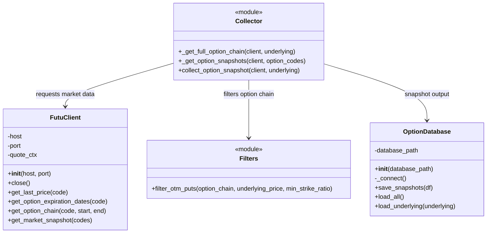
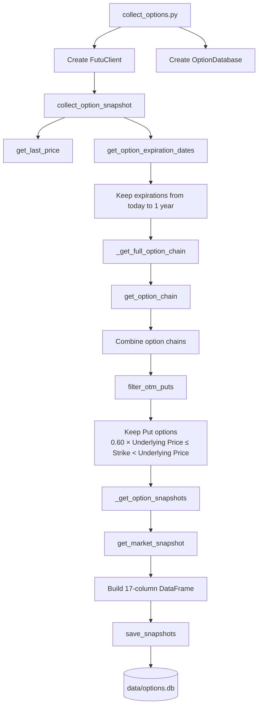
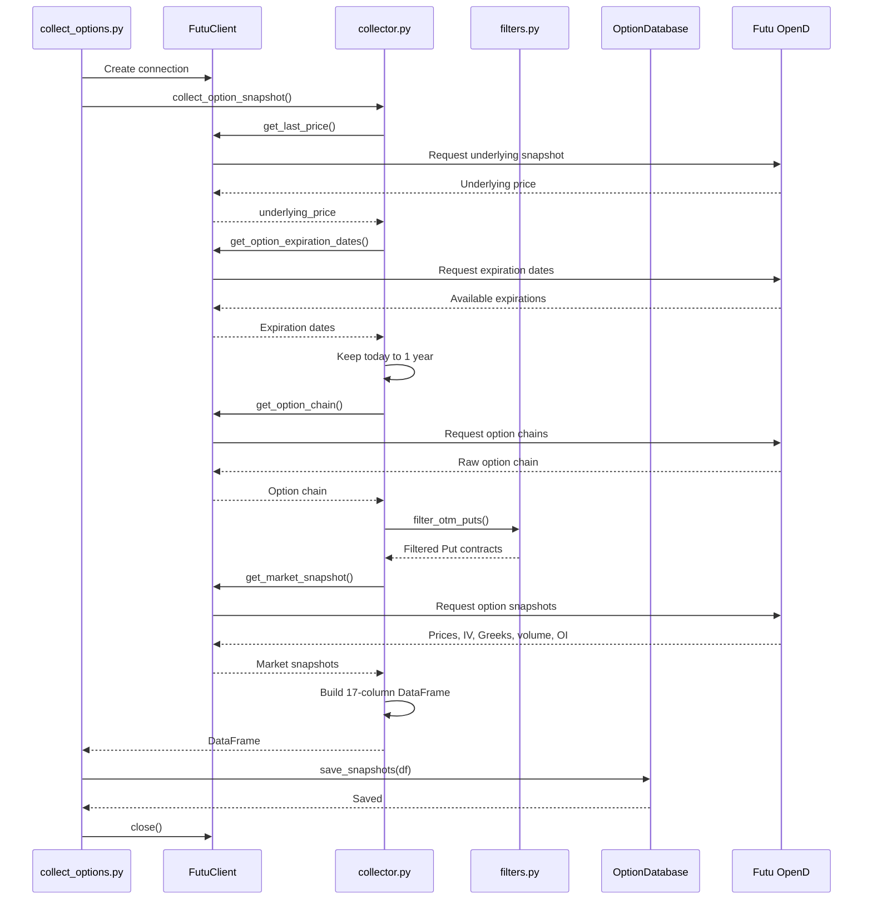
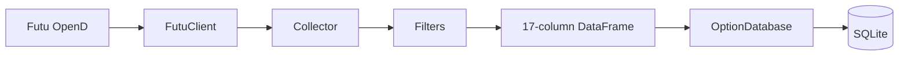

Copyright © 2026 Bo Hu. All rights reserved.

Created: September 13, 2026

# Architecture

This document describes the software architecture and data collection flow of the Lemon Option Quant project.

The system collects historical snapshots of U.S. put options through Futu OpenAPI and stores the processed data in a local SQLite database.

---

## Project Structure

```text
Lemon-option-quant/
│
├── README.md
├── pyproject.toml
├── requirements.txt
├── .gitignore
│
├── docs/
│   ├── architecture.md
│   └── data_schema.md
│
├── scripts/
│   ├── collect_options.py
│   └── test_connection.py
│
├── src/
│   └── option_quant/
│       ├── __init__.py
│       ├── config.py
│       ├── futu_client.py
│       ├── filters.py
│       ├── collector.py
│       └── database.py
│
└── data/
    └── options.db
```

The `data/` directory contains private market data and is excluded from Git through `.gitignore`.

---

## Class Diagram



---

## Data Collection Flow



---

## Main Collection Sequence



---

## Option Filtering Rules

The current option universe is restricted to put options.

The strike price must satisfy:

```text
0.60 × underlying_price <= strike < underlying_price
```

Therefore:

- Call options are excluded.
- In-the-money put options are excluded.
- Extremely deep out-of-the-money put options are excluded.
- Only expiration dates from today up to one year are collected.

The minimum strike ratio is currently:

```text
0.60
```

and can be adjusted later.

---

## Data Pipeline

The complete pipeline can be summarized as:



---

## Module Responsibilities

### `futu_client.py`

Responsible only for communication with Futu OpenAPI.

Main responsibilities:

- Connect to Futu OpenD
- Retrieve underlying prices
- Retrieve option expiration dates
- Retrieve option chains
- Retrieve option market snapshots

### `filters.py`

Responsible for option selection rules.

Current rules:

```text
Put only
OTM only
Strike >= 60% of underlying price
Strike < underlying price
```

### `collector.py`

Responsible for coordinating market-data collection.

It:

1. Retrieves the underlying price.
2. Retrieves available expiration dates.
3. Keeps expirations from today up to one year.
4. Retrieves option chains.
5. Applies option filters.
6. Retrieves market snapshots.
7. Builds the final 17-column DataFrame.

### `database.py`

Responsible for persistent historical storage.

Current database:

```text
data/options.db
```

Storage engine:

```text
SQLite
```

The database is private and is not committed to GitHub.

### `collect_options.py`

Main executable entry point for the data collection pipeline.

Run from the project root with:

```powershell
python scripts/collect_options.py
```

---

## Current Development Underlying

During the current testing phase:

```text
US.NVDA
```

is enabled.

Other planned underlyings are temporarily disabled in `config.py`:

```python
UNDERLYINGS = [
    "US.NVDA",
    # "US.GOOG",
    # "US.IREN",
    # "US.SPCX",
]
```

They can be enabled after the NVDA collection pipeline has been fully validated.