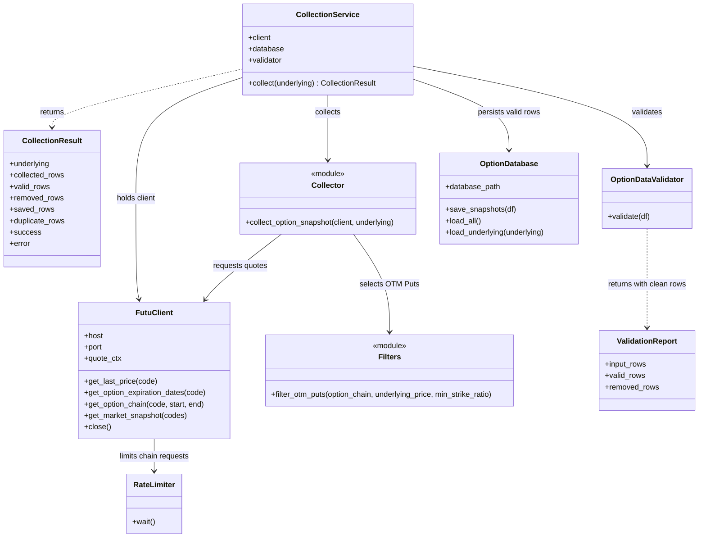
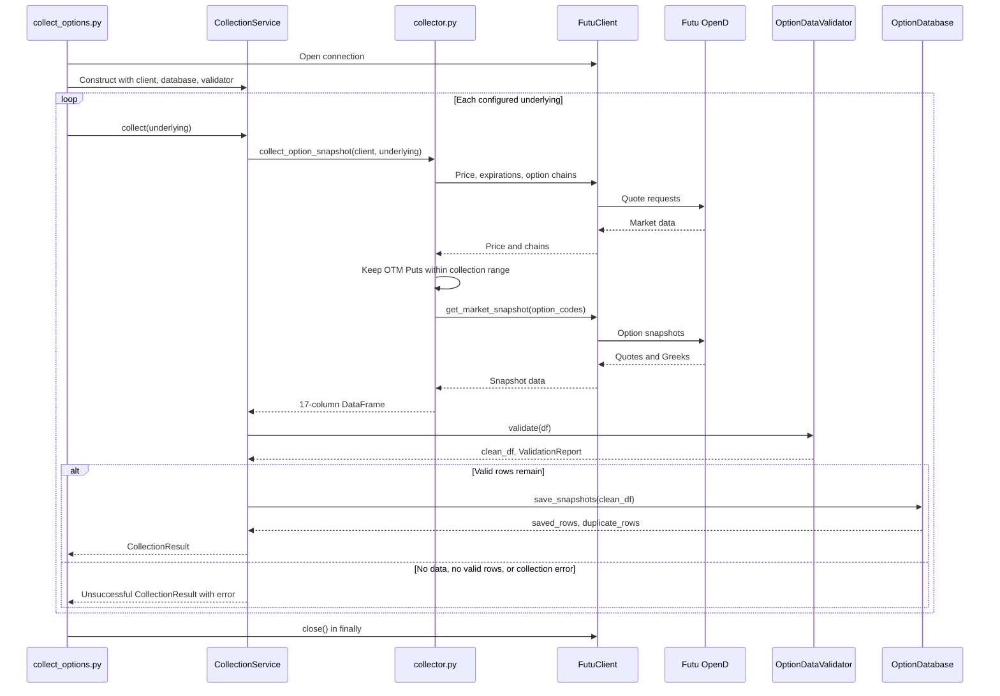
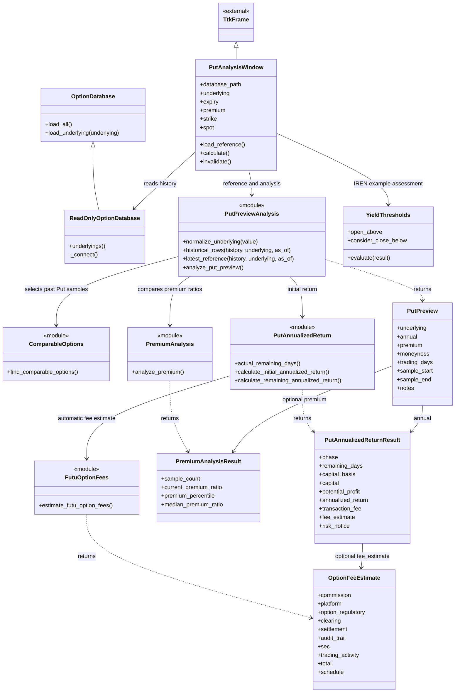
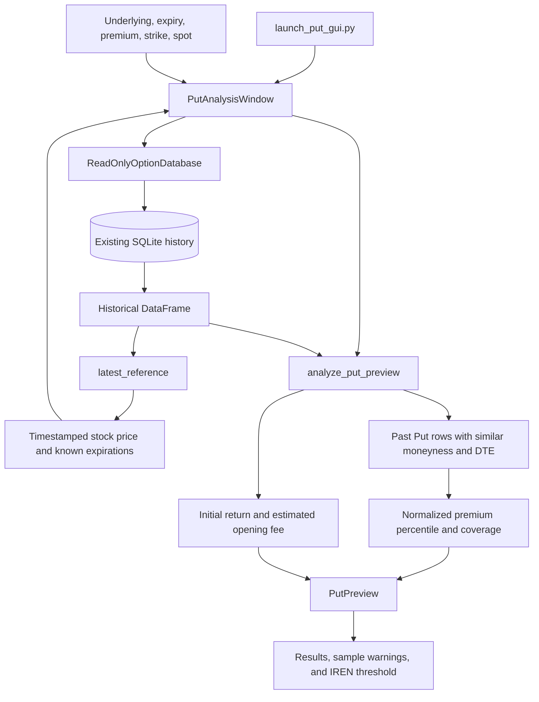

Copyright © 2026 Bo Hu. All rights reserved.

Created: September 13, 2026

Updated: September 28, 2026

# Architecture

Lemon Option Quant has two separate execution paths: an OpenD-backed collection pipeline that writes historical snapshots, and an offline Tkinter GUI that reads those snapshots and runs analytical functions. Both use the existing `option_quant` package.

## Entry Points and Boundaries

| Entry point | Purpose | OpenD | Database access |
|---|---|---|---|
| `scripts/collect_options.py` | Collect configured underlyings, validate, and save | Required | Read/write |
| `scripts/launch_put_gui.py` | Open the single-Put analysis window | Not used | Read-only |
| `scripts/analyze_put_return.py` | Run hypothetical initial/remaining-return examples | Not used | Not used |

The GUI launcher resolves the checkout's `src/` and `data/options.db` relative to its own path. The collection script uses `data/options.db` relative to the working directory and should be run from the project root. See [README](../README.md) for setup and the [GUI guide](put_gui.md) for interaction details.

## Collection Class Diagram

Boxes marked `module` represent real Python modules with functions, not additional classes. Class members below are selected public interfaces, not exhaustive signatures.

```mermaid
classDiagram
    class CollectionService {
        +client
        +database
        +validator
        +collect(underlying) CollectionResult
    }
    class CollectionResult {
        +underlying
        +collected_rows
        +valid_rows
        +removed_rows
        +saved_rows
        +duplicate_rows
        +success
        +error
    }
    class FutuClient {
        +host
        +port
        +quote_ctx
        +get_last_price(code)
        +get_option_expiration_dates(code)
        +get_option_chain(code, start, end)
        +get_market_snapshot(codes)
        +close()
    }
    class RateLimiter {
        +wait()
    }
    class Collector {
        <<module>>
        +collect_option_snapshot(client, underlying)
    }
    class Filters {
        <<module>>
        +filter_otm_puts(option_chain, underlying_price, min_strike_ratio)
    }
    class OptionDataValidator {
        +validate(df)
    }
    class ValidationReport {
        +input_rows
        +valid_rows
        +removed_rows
    }
    class OptionDatabase {
        +database_path
        +save_snapshots(df)
        +load_all()
        +load_underlying(underlying)
    }

    CollectionService --> FutuClient : holds client
    CollectionService --> Collector : collects
    Collector --> FutuClient : requests quotes
    Collector --> Filters : selects OTM Puts
    FutuClient --> RateLimiter : limits chain requests
    CollectionService --> OptionDataValidator : validates
    OptionDataValidator ..> ValidationReport : returns with clean rows
    CollectionService --> OptionDatabase : persists valid rows
    CollectionService ..> CollectionResult : returns
```

`CollectionService`, rather than `collector.py`, owns validation and persistence. The collector returns a DataFrame and has no direct database dependency. `FutuClient` uses `rate_limiter.py` and `retry.py` for option-chain requests.

## Collection Sequence

```mermaid
sequenceDiagram
    participant Script as collect_options.py
    participant Service as CollectionService
    participant Collector as collector.py
    participant Client as FutuClient
    participant OpenD as Futu OpenD
    participant Validator as OptionDataValidator
    participant DB as OptionDatabase

    Script->>Client: Open connection
    Script->>Service: Construct with client, database, validator
    loop Each configured underlying
        Script->>Service: collect(underlying)
        Service->>Collector: collect_option_snapshot(client, underlying)
        Collector->>Client: Price, expirations, option chains
        Client->>OpenD: Quote requests
        OpenD-->>Client: Market data
        Client-->>Collector: Price and chains
        Collector->>Collector: Keep OTM Puts within collection range
        Collector->>Client: get_market_snapshot(option_codes)
        Client->>OpenD: Option snapshots
        OpenD-->>Client: Quotes and Greeks
        Client-->>Collector: Snapshot data
        Collector-->>Service: 17-column DataFrame
        Service->>Validator: validate(df)
        Validator-->>Service: clean_df, ValidationReport
        alt Valid rows remain
            Service->>DB: save_snapshots(clean_df)
            DB-->>Service: saved_rows, duplicate_rows
            Service-->>Script: CollectionResult
        else No data, no valid rows, or collection error
            Service-->>Script: Unsuccessful CollectionResult with error
        end
    end
    Script->>Client: close() in finally
```

`config.py` currently enables `US.NVDA`, `US.GOOG`, `US.SPCX`, and `US.IREN`, with OpenD at `127.0.0.1:11111`. The collector keeps `0.60 × spot <= strike < spot` and expirations from today to approximately one year ahead. The configured collection script is manually run; no scheduler is installed by this project.

## GUI and Analysis Class Diagram

The window is a `ttk.Frame`. `ReadOnlyOptionDatabase` inherits existing database queries but replaces connection creation with SQLite `mode=ro`, closes each connection, and does not create directories or missing databases.

```mermaid
classDiagram
    class TtkFrame {
        <<external>>
    }
    class PutAnalysisWindow {
        +database_path
        +underlying
        +expiry
        +premium
        +strike
        +spot
        +load_reference()
        +calculate()
        +invalidate()
    }
    class OptionDatabase {
        +load_all()
        +load_underlying(underlying)
    }
    class ReadOnlyOptionDatabase {
        +underlyings()
        -_connect()
    }
    class PutPreviewAnalysis {
        <<module>>
        +normalize_underlying(value)
        +historical_rows(history, underlying, as_of)
        +latest_reference(history, underlying, as_of)
        +analyze_put_preview()
    }
    class ComparableOptions {
        <<module>>
        +find_comparable_options()
    }
    class PremiumAnalysis {
        <<module>>
        +analyze_premium()
    }
    class PutAnnualizedReturn {
        <<module>>
        +actual_remaining_days()
        +calculate_initial_annualized_return()
        +calculate_remaining_annualized_return()
    }
    class FutuOptionFees {
        <<module>>
        +estimate_futu_option_fees()
    }
    class PutPreview {
        +underlying
        +annual
        +premium
        +moneyness
        +trading_days
        +sample_start
        +sample_end
        +notes
    }
    class PremiumAnalysisResult {
        +sample_count
        +current_premium_ratio
        +premium_percentile
        +median_premium_ratio
    }
    class PutAnnualizedReturnResult {
        +phase
        +remaining_days
        +capital_basis
        +capital
        +potential_profit
        +annualized_return
        +transaction_fee
        +fee_estimate
        +risk_notice
    }
    class OptionFeeEstimate {
        +commission
        +platform
        +option_regulatory
        +clearing
        +settlement
        +audit_trail
        +sec
        +trading_activity
        +total
        +schedule
    }
    class YieldThresholds {
        +open_above
        +consider_close_below
        +evaluate(result)
    }

    TtkFrame <|-- PutAnalysisWindow
    OptionDatabase <|-- ReadOnlyOptionDatabase
    PutAnalysisWindow --> ReadOnlyOptionDatabase : reads history
    PutAnalysisWindow --> PutPreviewAnalysis : reference and analysis
    PutPreviewAnalysis --> ComparableOptions : selects past Put samples
    PutPreviewAnalysis --> PremiumAnalysis : compares premium ratios
    PutPreviewAnalysis --> PutAnnualizedReturn : initial return
    PutPreviewAnalysis ..> PutPreview : returns
    PremiumAnalysis ..> PremiumAnalysisResult : returns
    PutAnnualizedReturn --> FutuOptionFees : automatic fee estimate
    FutuOptionFees ..> OptionFeeEstimate : returns
    PutAnnualizedReturn ..> PutAnnualizedReturnResult : returns
    PutPreview --> PutAnnualizedReturnResult : annual
    PutPreview --> PremiumAnalysisResult : optional premium
    PutAnnualizedReturnResult --> OptionFeeEstimate : optional fee_estimate
    PutAnalysisWindow --> YieldThresholds : IREN example assessment
```

`PutPreviewAnalysis` corresponds to `analytics/put_preview.py`; the other module boxes correspond to their snake-case filenames. `OptionFeeEstimate.total` is a computed property. `YieldThresholds` belongs to `put_annualized_return.py`. IV analysis remains an independent existing module and is not connected to this GUI.

## GUI Data Flow

```mermaid
flowchart TD
    Launch[launch_put_gui.py] --> Window[PutAnalysisWindow]
    Inputs[Underlying, expiry, premium, strike, spot] --> Window
    Window --> Reader[ReadOnlyOptionDatabase]
    Reader --> DB[(Existing SQLite history)]
    DB --> History[Historical DataFrame]
    History --> Reference[latest_reference]
    Reference --> ReferenceFields[Timestamped stock price and known expirations]
    ReferenceFields --> Window
    Window --> Preview[analyze_put_preview]
    History --> Preview
    Preview --> Return[Initial return and estimated opening fee]
    Preview --> Match[Past Put rows with similar moneyness and DTE]
    Match --> Stats[Normalized premium percentile and coverage]
    Stats --> Result[PutPreview]
    Return --> Result
    Result --> Display[Results, sample warnings, and IREN threshold]
```

Selecting a historical quote fills the stock-price field and labels it with its timestamp. It does not retrieve live market data. Changing the ticker clears the old stock price; changing calculation inputs invalidates prior results. The expiration selector is editable and populated from history, not a live option chain.

The analysis function computes initial return independently of historical availability. Missing history, a missing spot, an ITM target, or no comparable observations produces an unavailable percentile and an explanatory note, while valid annualized return remains available. Invalid user values clear the results and show an error.

## Calculation Contracts

| Concern | Current implementation |
|---|---|
| GUI position | One unadjusted standard Put, 100 shares |
| GUI dates | New York calendar date to selected expiry; same-day expiry rejected |
| Historical match | Same underlying; moneyness ±0.02; DTE ±5; timestamps strictly before valuation |
| Percentile | Fraction of historical `last / underlying_price` strictly below current `premium / spot`, multiplied by 100 |
| Sample weighting | Snapshot rows; coverage reports distinct New York dates, not independent trades |
| Sample warning | Fewer than 20 comparable rows or fewer than 5 distinct trading dates |
| GUI annualization | Initial net premium / full strike collateral × 365 / remaining calendar days |
| Fees | Futu HK fixed plan, snapshot checked 2026-09-28; calculated estimate rather than exact statement replication |
| Thresholds | IREN GUI uses >30% initial example; independent module also supports <20% remaining example |
| Remaining return | Current buyback premium plus avoided closing fee, less any expiry fee; no original premium or opening fee |

The independent return module supports more than the GUI: multiple contracts, aware datetimes with fractional remaining days, manually overridden fees, and `CapitalBasis.NET_CAPITAL`. The GUI uses the default `GROSS_COLLATERAL` basis. See [return definitions](put_annualized_return.md) for exact formulas and the distinction between net capital and cash required on assignment.

## Storage and Time

- `OptionDatabase` persists raw snapshots to `option_snapshots`; the GUI does not persist form inputs or calculated results.
- UTC timestamps are canonicalized on save. Duplicate detection uses underlying, option code, and New York trading date.
- `time_utils.py` provides timezone conversion and trading-day boundaries.
- The GUI read path excludes malformed timestamps, nonfinite prices, invalid DTEs, calls, and future/current-time snapshots before historical comparison.
- `data/` is private and ignored by Git. See [schema](data_schema.md) for all 17 stored fields.

## Verification and Scope

The targeted offline suite covers fee rates and minimums, return formulas, strict thresholds, date handling, comparable filtering, read-only SQLite access, and Tk callbacks. See the [README test commands](../README.md#tests). Tests use temporary databases and hidden Tk windows; they do not need OpenD.

GUI integration currently ends at opening analysis. A holding-period view can reuse `calculate_remaining_annualized_return` later. Automatic trading, Risk Analysis, and Event Analysis are not implemented as part of this work. A displayed annualized return assumes worthless expiry without assignment; the UI includes an assignment-risk notice.
